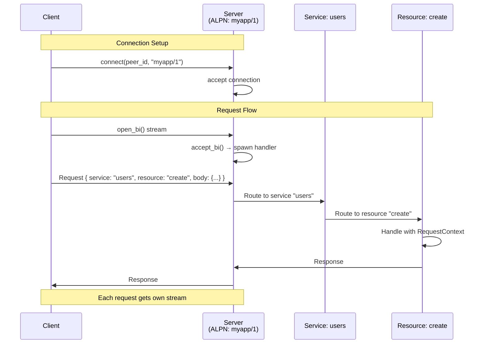

# Zel RPC Framework

A type-safe RPC framework built on [Iroh](https://iroh.computer/)! Out of the box support for methods, subscriptions (server to client stream), notifications (client to server stream), and raw bidirectional streams.

## Table of Contents

- [Architecture Overview](#architecture-overview)
- [Iroh Integration](#iroh-integration)
  - [Connection Lifecycle](#connection-lifecycle)
  - [Stream Types](#stream-types)
- [RequestContext & Extensions](#requestcontext--extensions)
  - [Three-Tier Extension System](#three-tier-extension-system)
  - [Extension Lifecycle](#extension-lifecycle)
  - [Connection Hooks](#connection-hooks)
  - [Request Middleware](#request-middleware)
- [Service Definition](#service-definition)
  - [Methods](#methods)
  - [Subscriptions](#subscriptions)
  - [Notifications](#notifications)
  - [Raw Streams](#raw-streams)
- [Examples](#examples)

---

## Architecture Overview

Zel RPC provides four types of endpoints:

1. **Methods** (`#[method]`) - Request/response RPC calls
2. **Subscriptions** (`#[subscription]`) - Server-to-client streaming
3. **Notifications** (`#[notification]`) - Client-to-server streaming
4. **Raw Streams** (`#[stream]`) - Bidirectional custom protocols (BYOP)

All endpoints receive a `RequestContext` providing access to:
- The underlying Iroh connection
- Three-tier extension system (server/connection/request)
- Remote peer information

---

## Iroh Integration

### Connection Lifecycle

---

## RequestContext & Extensions

Zel uses a three-tier extension system to share context across different scopes:

#### Server Extensions (Shared)
- Database connection pools, configuration, shared caches, metrics collectors

#### Connection Extensions (Isolated)
- User sessions, authentication state, per-peer metrics

#### Request Extensions (Unique)
- Distributed trace IDs, request timing, per-call context

**📚 For complete documentation, see [`doc_more/EXTENSIONS.MD`](doc_more/EXTENSIONS.MD)**

**💡 For working examples, see [`examples/context_extensions_demo.rs`](zel_core/examples/context_extensions_demo.rs)**

---

## Service Definition

### Methods
Request/response RPC - handler receives `RequestContext` as first parameter

### Subscriptions
Server-to-client streaming - handler receives `RequestContext` and typed `sink`

### Notifications
Client-to-server streaming - handler receives `RequestContext`, receive stream, and ack sender

### Raw Streams
Custom bidirectional protocols - handler receives `RequestContext`, `SendStream`, `RecvStream`

**See [`examples/macro_service_example.rs`](zel_core/examples/macro_service_example.rs) and [`examples/notification_example.rs`](zel_core/examples/notification_example.rs) for complete service definitions**

---

## Examples

Explore the [`zel_core/examples/`](zel_core/examples/) directory for working examples:

- **[`context_extensions_demo.rs`](zel_core/examples/context_extensions_demo.rs)** - Three-tier extension system with database pools, sessions, and tracing
- **[`macro_service_example.rs`](zel_core/examples/macro_service_example.rs)** - Service definition with methods and subscriptions
- **[`multi_service_example.rs`](zel_core/examples/multi_service_example.rs)** - Multiple services on single server
- **[`notification_example.rs`](zel_core/examples/notification_example.rs)** - Client-to-server streaming
- **[`raw_stream_example.rs`](zel_core/examples/raw_stream_example.rs)** - Custom bidirectional protocol (file transfer)