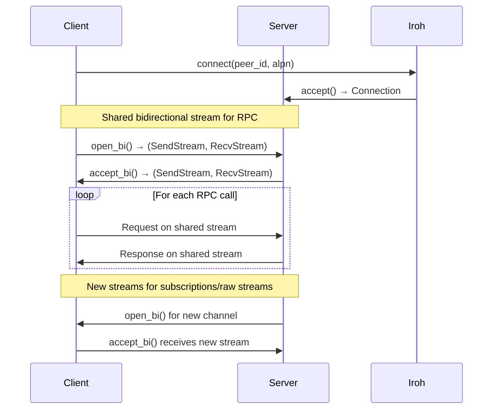
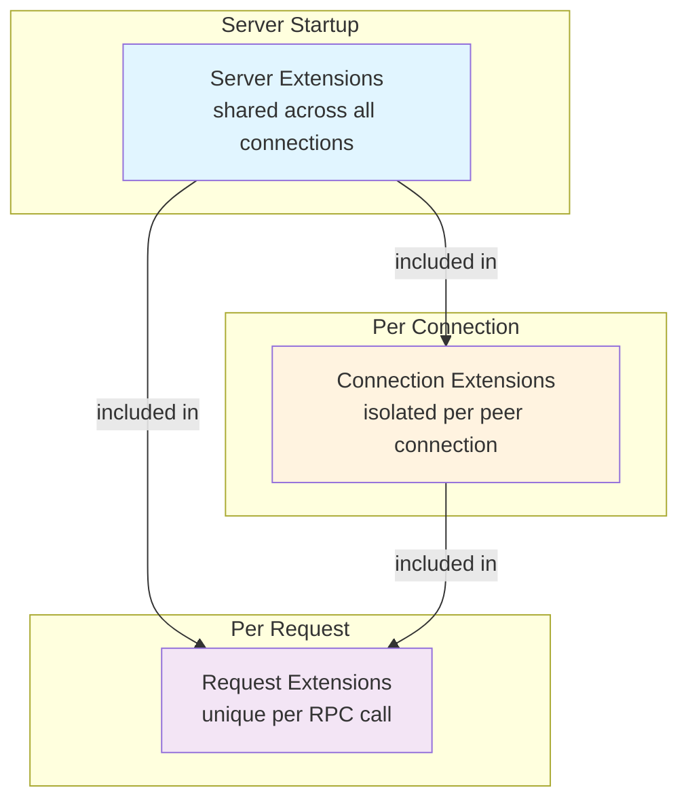
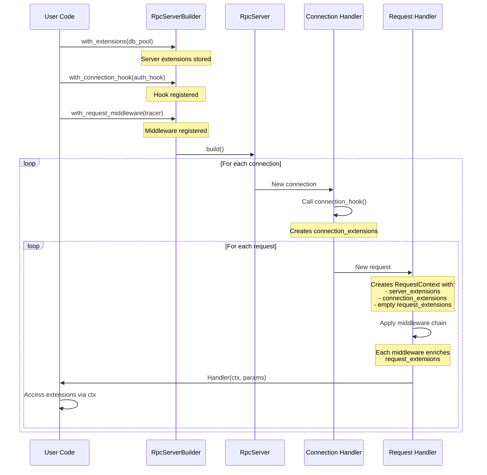

# Zel RPC Framework

A type-safe RPC framework built on [Iroh](https://iroh.computer/)! Out of the box support for methods, subscriptions, and raw bidirectional streams.

## Table of Contents

- [Architecture Overview](#architecture-overview)
- [Iroh Integration](#iroh-integration)
  - [Connection Lifecycle](#connection-lifecycle)
  - [Stream Types](#stream-types)
  - [Critical: Stream Establishment](#critical-stream-establishment)
- [RequestContext & Extensions](#requestcontext--extensions)
  - [Three-Tier Extension System](#three-tier-extension-system)
  - [Extension Lifecycle](#extension-lifecycle)
  - [Connection Hooks](#connection-hooks)
  - [Request Middleware](#request-middleware)
- [Service Definition](#service-definition)
  - [Methods](#methods)
  - [Subscriptions](#subscriptions)
  - [Raw Streams](#raw-streams)
- [Examples](#examples)

---

## Architecture Overview

Zel RPC provides three types of endpoints:

1. **Methods** (`#[method]`) - Request/response RPC calls
2. **Subscriptions** (`#[subscription]`) - Server-to-client streaming
3. **Raw Streams** (`#[stream]`) - Bidirectional custom protocols (BYOP)

All endpoints receive a `RequestContext` providing access to:
- The underlying Iroh connection
- Three-tier extension system (server/connection/request)
- Remote peer information

---

## Iroh Integration

### Connection Lifecycle



### Stream Types

Zel RPC uses Iroh's QUIC-based streams in different ways:

#### 1. Shared Bidirectional Stream (RPC Control Channel)

```rust
// Created once per connection
let (tx, rx) = connection.open_bi().await?;
let mut tx = FramedWrite::new(tx, LengthDelimitedCodec::new());
let mut rx = FramedRead::new(rx, LengthDelimitedCodec::new());
```

**Used for:**
- Method request/response pairs
- Subscription setup requests
- Stream setup requests

**Lifecycle:** Long-lived, one per client connection which is kept alive for the entire life of the connection

> This provides a "lazy" type of flow control. Subscriptions and streams get their own streams. But, RPC calls and calls to establish subscriptions and streams flow through this one channel.

#### 2. Subscription Streams (Unidirectional Data Flow)

```rust
// Server opens NEW bidi stream for subscription
let (sub_tx, _) = connection.open_bi().await?;
let mut sub_tx = FramedWrite::new(sub_tx, LengthDelimitedCodec::new());

// Client accepts the stream
let (_, sub_rx) = connection.accept_bi().await?;
let mut sub_rx = FramedRead::new(sub_rx, LengthDelimitedCodec::new());
```

**Used for:** Server pushing data to client over time

**Lifecycle:** Created per subscription, closed when subscription ends

#### 3. Raw Streams (Custom Bidirectional Protocols)

```rust
// Server opens NEW bidi stream
let (stream_tx, stream_rx) = connection.open_bi().await?;
// NO codec wrapping - raw bytes

// Client accepts the stream  
let (stream_tx, stream_rx) = connection.accept_bi().await?;
// Full control over wire format
```

**Used for:** Custom protocols (file transfer, video streaming, etc.)

**Lifecycle:** Created per stream request, managed by application

### Critical: Stream Establishment

⚠️ **IMPORTANT:** Iroh's `open_bi()` doesn't notify the peer until you write to the `SendStream`:

```rust
// From Iroh docs:
// "Calling open_bi() then waiting on the RecvStream without writing
// anything to SendStream will never succeed."
```

**Zel RPC's Solution:**

```rust
// Server MUST write ACK immediately after opening stream
let (mut stream_tx, stream_rx) = connection.open_bi().await?;
stream_tx.write_all(b"OK").await?; // ← CRITICAL: Establishes stream

// Now client's accept_bi() will succeed
let (stream_tx, mut stream_rx) = connection.accept_bi().await?;
stream_rx.read_exact(&mut ack).await?; // ← Reads ACK
```

**This applies to:**
- ✅ Subscriptions (send ACK message)
- ✅ Raw Streams (send "OK" bytes)
- ❌ NOT methods (use shared stream, already established)

---

## RequestContext & Extensions

### Three-Tier Extension System



#### Server Extensions (Shared)

**Purpose:** Share resources across ALL connections

**Common uses:**
- Database connection pools
- Configuration
- Shared caches
- Metrics collectors

**Example:**
```rust
let db_pool = Arc::new(DatabasePool::connect("...").await?);
let server_exts = Extensions::new().with(db_pool);

let server = RpcServerBuilder::new(b"api/1", endpoint)
    .with_extensions(server_exts)  // ← Set at server build time
    .build();
```

**Access in handler:**
```rust
async fn create_user(&self, ctx: RequestContext, user: User) -> Result<UserId, String> {
    let db = ctx.server_extensions()
        .get::<Arc<DatabasePool>>()
        .ok_or("No database configured")?;
    
    // All requests share the same pool
    db.execute("INSERT INTO users ...").await?;
    Ok(UserId::new())
}
```

#### Connection Extensions (Isolated)

**Purpose:** Store per-connection state (e.g., authenticated user)

**Common uses:**
- User sessions
- Authentication state
- Per-peer metrics
- Connection-specific configuration

**Set via Connection Hook:**
```rust
let hook: ConnectionHook = Arc::new(|connection| {
    Box::pin(async move {
        // Authenticate the peer
        let user_id = authenticate(&connection).await?;
        let session = Session { user_id, connected_at: Instant::now() };
        
        Ok(Extensions::new().with(session))
    })
});

let server = RpcServerBuilder::new(b"api/1", endpoint)
    .with_connection_hook(hook)  // ← Called for each new connection
    .build();
```

**Access in handler:**
```rust
async fn get_profile(&self, ctx: RequestContext) -> Result<Profile, String> {
    let session = ctx.connection_extensions()
        .get::<Session>()
        .ok_or("Not authenticated")?;
    
    // Each connection has its own session
    self.db.get_user(session.user_id).await
}
```

#### Request Extensions (Unique)

**Purpose:** Store per-request state (e.g., trace ID, timing)

**Common uses:**
- Distributed trace IDs
- Request timing
- Per-call context
- Temporary caching

**Set via Request Middleware:**
```rust
let middleware: RequestMiddleware = Arc::new(|ctx| {
    Box::pin(async move {
        let trace_id = TraceId::new();
        ctx.with_extension(trace_id)
    })
});

let server = RpcServerBuilder::new(b"api/1", endpoint)
    .with_request_middleware(middleware)  // ← Called for each request
    .build();
```

**Access in handler:**
```rust
async fn process(&self, ctx: RequestContext, data: Data) -> Result<Output, String> {
    if let Some(trace) = ctx.extensions().get::<TraceId>() {
        log::info!("[{:?}] Processing {}", trace.0, ctx.resource());
    }
    
    // Each request has unique trace ID
    Ok(Output::new())
}
```

### Extension Lifecycle



### Connection Hooks

Connection hooks run **once per connection** before any requests are processed:

```rust
pub type ConnectionHook = Arc<
    dyn Send + Sync + Fn(Connection) -> BoxFuture<'static, anyhow::Result<Extensions>>
>;
```

**Pattern:**
```rust
let hook = Arc::new(|connection: Connection| {
    Box::pin(async move {
        // Perform async operations
        let peer_id = connection.remote_id();
        let metadata = load_peer_metadata(peer_id).await?;
        
        // Return extensions for this connection
        Ok(Extensions::new()
            .with(metadata)
            .with(PeerMetrics::new(peer_id)))
    })
});
```

### Request Middleware

Request middleware runs **for every request** in a chain:

```rust
pub type RequestMiddleware = Arc<
    dyn Send + Sync + Fn(RequestContext) -> BoxFuture<'static, RequestContext>
>;
```

**Pattern:**
```rust
let tracer = Arc::new(|ctx: RequestContext| {
    Box::pin(async move {
        let trace_id = TraceId::new();
        let start = Instant::now();
        
        // Add extensions and return enriched context
        ctx.with_extension(trace_id)
           .with_extension(start)
    })
});

let logger = Arc::new(|ctx: RequestContext| {
    Box::pin(async move {
        log::info!("Request: {}/{}", ctx.service(), ctx.resource());
        ctx
    })
});

// Middleware executes in order
let server = builder
    .with_request_middleware(tracer)   // ← First
    .with_request_middleware(logger)   // ← Second
    .build();
```

---

## Service Definition

### Methods

Standard request/response RPC:

```rust
#[zel_service(name = "calc")]
trait Calculator {
    #[method(name = "add")]
    async fn add(&self, a: i32, b: i32) -> Result<i32, String>;
}

#[async_trait]
impl CalculatorServer for CalculatorImpl {
    async fn add(&self, ctx: RequestContext, a: i32, b: i32) -> Result<i32, String> {
        log::info!("add called from {}", ctx.remote_id());
        Ok(a + b)
    }
}
```

**Generated signature includes `ctx: RequestContext` as first parameter**

### Subscriptions

Server-to-client streaming:

```rust
#[zel_service(name = "calc")]
trait Calculator {
    #[subscription(name = "counter")]
    async fn counter(&self, interval_ms: u64) -> Result<(), String>;
}

#[async_trait]
impl CalculatorServer for CalculatorImpl {
    async fn counter(
        &self,
        ctx: RequestContext,
        mut sink: CalculatorCounterSink,
        interval_ms: u64,
    ) -> Result<(), String> {
        for i in 0..10 {
            tokio::time::sleep(Duration::from_millis(interval_ms)).await;
            sink.send(CounterMsg { count: i }).await?;
        }
        sink.close().await?;
        Ok(())
    }
}
```

**Generated signature includes `ctx: RequestContext` and typed `sink` parameter**

### Raw Streams

Custom bidirectional protocols:

```rust
#[zel_service(name = "file")]
trait FileService {
    #[stream(name = "transfer")]
    async fn transfer_file(&self, filename: String) -> Result<(), String>;
}

#[async_trait]
impl FileServiceServer for FileServiceImpl {
    async fn transfer_file(
        &self,
        ctx: RequestContext,
        mut send: iroh::endpoint::SendStream,
        mut recv: iroh::endpoint::RecvStream,
        filename: String,
    ) -> Result<(), String> {
        // Custom protocol - full control over wire format
        loop {
            let mut size_buf = [0u8; 4];
            recv.read_exact(&mut size_buf).await?;
            let size = u32::from_be_bytes(size_buf);
            
            if size == 0 { break; }
            
            let mut chunk = vec![0u8; size as usize];
            recv.read_exact(&mut chunk).await?;
            
            send.write_all(b"ACK").await?;
        }
        Ok(())
    }
}
```

**Generated signature includes `ctx: RequestContext`, `send: SendStream`, `recv: RecvStream`, and user parameters**

**Client usage:**
```rust
let file_client = FileServiceClient::new(rpc_client);

// Returns RAW Iroh streams - no framing
let (mut send, mut recv) = file_client.transfer_file("test.txt".to_string()).await?;

// Custom protocol
send.write_all(&chunk_size.to_be_bytes()).await?;
send.write_all(&chunk_data).await?;

let mut ack = [0u8; 3];
recv.read_exact(&mut ack).await?;
```

---

## Examples

### Basic RPC with Extensions

```rust
use zel_core::protocol::{RpcServerBuilder, Extensions};
use std::sync::Arc;

// Server extension (shared)
let db_pool = Arc::new(DatabasePool::connect("...").await?);
let server_exts = Extensions::new().with(db_pool);

// Connection hook (per-connection)
let auth_hook = Arc::new(|connection| {
    Box::pin(async move {
        let session = authenticate(&connection).await?;
        Ok(Extensions::new().with(session))
    })
});

// Request middleware (per-request)
let tracer = Arc::new(|ctx| {
    Box::pin(async move {
        ctx.with_extension(TraceId::new())
    })
});

// Build server
let server = RpcServerBuilder::new(b"api/1", endpoint)
    .with_extensions(server_exts)
    .with_connection_hook(auth_hook)
    .with_request_middleware(tracer)
    .service("users")
    .build();
```

### Raw Stream File Transfer

See [`examples/raw_stream_example.rs`](zel_core/examples/raw_stream_example.rs) for complete example.

```rust
// Define service with stream endpoint
#[zel_service(name = "file")]
trait FileService {
    #[stream(name = "transfer")]
    async fn transfer_file(&self, filename: String) -> Result<(), String>;
}

// Server implementation
async fn transfer_file(
    &self,
    _ctx: RequestContext,
    mut send: iroh::endpoint::SendStream,
    mut recv: iroh::endpoint::RecvStream,
    filename: String,
) -> Result<(), String> {
    // Custom chunked protocol
    loop {
        let mut size_buf = [0u8; 4];
        match recv.read_exact(&mut size_buf).await {
            Ok(_) => {},
            Err(_) => break,
        }
        
        let size = u32::from_be_bytes(size_buf);
        if size == 0 { break; }
        
        let mut chunk = vec![0u8; size as usize];
        recv.read_exact(&mut chunk).await?;
        
        send.write_all(b"ACK").await?;
    }
    Ok(())
}

// Client usage
let (mut send, mut recv) = file_client.transfer_file("test.txt".to_string()).await?;

for chunk in chunks {
    send.write_all(&chunk.len().to_be_bytes()).await?;
    send.write_all(&chunk).await?;

    let mut ack = [0u8; 3];
    recv.read_exact(&mut ack).await?;
}

send.write_all(&0u32.to_be_bytes()).await?;
send.finish()?;
```
