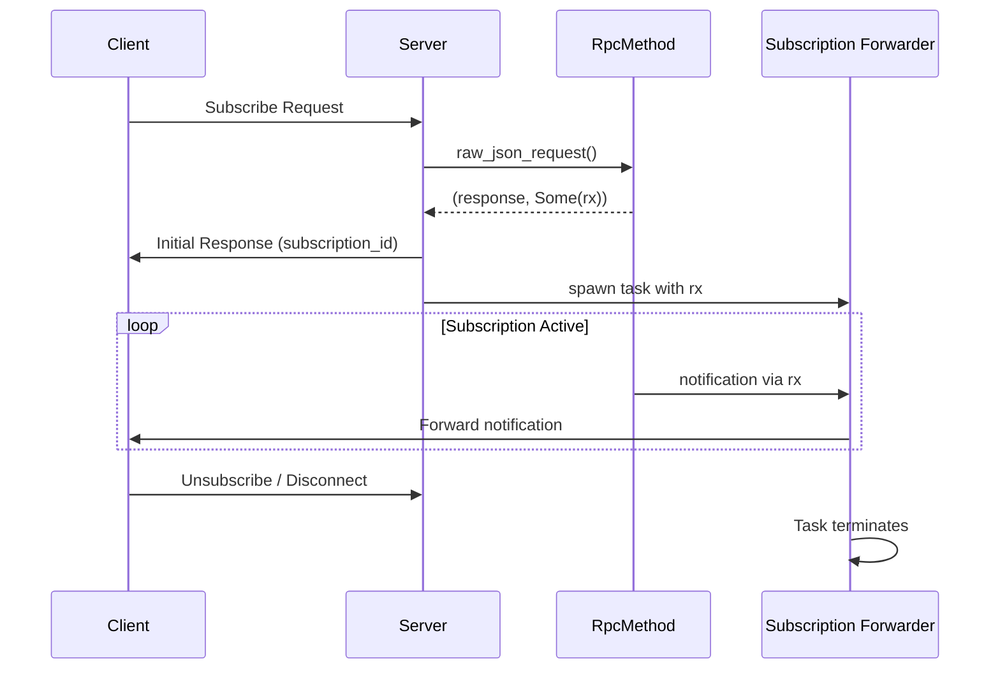
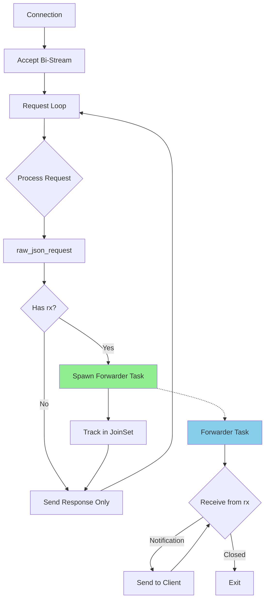

# JSON-RPC Subscriptions Implementation Plan

## Executive Summary

Enable server-side subscription support for JSON-RPC over Iroh by implementing automatic notification forwarding. The current implementation discards subscription receivers, preventing notifications from reaching clients.

**Approach:** Phase 1 - Simple and Working
- Sender cloning via Arc<Mutex<SendStream>>
- One forwarder task per subscription
- Close connection on subscription errors
- Limit: 100 subscriptions per connection

---

## Current State Analysis

### Problem Location
**File:** `zel_core/src/request_reply/json_rpc/server.rs:150-151`

```rust
let response = match methods.raw_json_request(&request, 1024).await {
    Ok((response, _rx)) => {  // ❌ _rx is discarded!
        response.get().to_string()
    }
```

**What's Lost:**
- `_rx`: `Option<mpsc::Receiver<String>>` - subscription notification receiver
- When `Some`, indicates the request created a subscription
- Must forward notifications to client for subscriptions to work

---

## Architecture

### Flow Diagram



### Component Interaction



---

## Implementation Steps

### Step 1: Make IrohSender Cloneable

**File:** `zel_core/src/request_reply/json_rpc/transport.rs`

**Changes:**

1. Wrap `SendStream` and buffer in `Arc<Mutex<>>`
2. Implement `Clone` trait
3. Update `send()` method to acquire locks

**Before:**
```rust
pub struct IrohSender {
    send: SendStream,
    max_request_size: usize,
    buffer: Vec<u8>,
}
```

**After:**
```rust
use std::sync::Arc;
use tokio::sync::Mutex;

pub struct IrohSender {
    send: Arc<Mutex<SendStream>>,
    max_request_size: usize,
    buffer: Arc<Mutex<Vec<u8>>>,
}

impl Clone for IrohSender {
    fn clone(&self) -> Self {
        Self {
            send: Arc::clone(&self.send),
            max_request_size: self.max_request_size,
            buffer: Arc::new(Mutex::new(Vec::with_capacity(self.max_request_size))),
        }
    }
}
```

**Update `new()` method:**
```rust
pub(crate) fn new(send: SendStream, max_request_size: usize) -> Self {
    Self {
        send: Arc::new(Mutex::new(send)),
        max_request_size,
        buffer: Arc::new(Mutex::new(Vec::with_capacity(max_request_size))),
    }
}
```

**Update `send()` method:**
```rust
async fn send(&mut self, msg: String) -> Result<(), Self::Error> {
    let len = msg.len();
    if len > self.max_request_size {
        error!("Length {len} larger than max_request_size {}", self.max_request_size);
        return Err(IrohTransportError::MessageTooLarge {
            size: len,
            max: self.max_request_size,
        });
    }

    let mut buffer = self.buffer.lock().await;
    
    // COBS encode
    buffer.clear();
    buffer.resize(msg.len() + (msg.len() / 254) + 2, 0);
    match cobs::try_encode(msg.as_bytes(), &mut buffer) {
        Ok(encoded_len) => buffer.truncate(encoded_len),
        Err(e) => {
            error!("COBS encoding failed: {e}");
            return Err(IrohTransportError::CobsEncode(e.to_string()));
        }
    }
    buffer.push(0x00);

    // Write to stream
    let mut send = self.send.lock().await;
    send.write_all(&buffer)
        .await
        .map_err(|e| IrohTransportError::Io(io::Error::new(io::ErrorKind::Other, e)))?;
    send.flush()
        .await
        .map_err(|e| IrohTransportError::Io(io::Error::new(io::ErrorKind::Other, e)))?;

    Ok(())
}
```

---

### Step 2: Add Subscription Forwarder Function

**File:** `zel_core/src/request_reply/json_rpc/server.rs`

**Add after imports:**
```rust
use tokio::task::JoinSet;
use tokio::sync::mpsc;
```

**Add new function:**
```rust
/// Forward subscription notifications from jsonrpsee to the client
///
/// This task listens on the subscription receiver and forwards each
/// notification to the client through the Iroh transport.
async fn forward_subscription_notifications(
    mut rx: mpsc::Receiver<String>,
    mut sender: IrohSender,
    sub_id: String,
) -> Result<(), IrohTransportError> {
    log::debug!("Subscription forwarder started for {}", sub_id);
    
    while let Some(notification) = rx.recv().await {
        log::trace!("Forwarding subscription notification for {}: {}", sub_id, notification);
        
        if let Err(e) = sender.send(notification).await {
            log::error!("Failed to send subscription notification for {}: {}", sub_id, e);
            return Err(e);
        }
    }
    
    log::debug!("Subscription forwarder completed for {}", sub_id);
    Ok(())
}

/// Extract subscription ID from response for logging
fn extract_subscription_id(response: &serde_json::value::RawValue) -> String {
    serde_json::from_str::<serde_json::Value>(response.get())
        .ok()
        .and_then(|v| v.get("result").and_then(|r| r.as_str()))
        .unwrap_or("unknown")
        .to_string()
}
```

---

### Step 3: Update Connection Handler

**File:** `zel_core/src/request_reply/json_rpc/server.rs`

**Replace `handle_jsonrpc_connection` function:**

```rust
/// Handle a single JSON-RPC connection with subscription support
///
/// This function processes requests from a client in a loop until the connection
/// closes or an error occurs. It now handles subscriptions by spawning forwarder
/// tasks for each subscription.
async fn handle_jsonrpc_connection(
    connection: Connection,
    methods: Methods,
    max_request_size: usize,
    max_response_size: usize,
) -> Result<(), IrohTransportError> {
    // Accept connection and create transport
    let (mut sender, mut receiver) =
        accept_connection(&connection, max_request_size, max_response_size).await?;

    // Track active subscription forwarder tasks
    let mut subscription_tasks = JoinSet::new();
    const MAX_SUBSCRIPTIONS_PER_CONNECTION: usize = 100;

    // Process requests in a loop
    loop {
        tokio::select! {
            // Handle incoming requests
            request_result = receiver.receive() => {
                let request = match request_result {
                    Ok(ReceivedMessage::Text(msg)) => msg,
                    Ok(ReceivedMessage::Bytes(_)) => {
                        log::warn!("Received unexpected binary message, ignoring");
                        continue;
                    }
                    Ok(ReceivedMessage::Pong) => {
                        log::debug!("Received pong");
                        continue;
                    }
                    Err(e) => {
                        log::debug!("Connection closed or error receiving message: {e}");
                        break;
                    }
                };

                // Process request with jsonrpsee
                let response = match methods.raw_json_request(&request, 1024).await {
                    Ok((response, subscription_rx)) => {
                        // Handle subscription if present
                        if let Some(rx) = subscription_rx {
                            // Check subscription limit
                            if subscription_tasks.len() >= MAX_SUBSCRIPTIONS_PER_CONNECTION {
                                log::error!(
                                    "Subscription limit reached ({} active subscriptions)",
                                    MAX_SUBSCRIPTIONS_PER_CONNECTION
                                );
                                // Send error response
                                format!(
                                    r#"{{"jsonrpc":"2.0","id":null,"error":{{"code":-32000,"message":"Too many active subscriptions"}}}}"#
                                )
                            } else {
                                // Extract subscription ID for logging
                                let sub_id = extract_subscription_id(&response);
                                log::info!("New subscription created: {}", sub_id);

                                // Clone sender for the forwarder task
                                let sender_clone = sender.clone();
                                let sub_id_clone = sub_id.clone();

                                // Spawn forwarder task
                                subscription_tasks.spawn(async move {
                                    forward_subscription_notifications(rx, sender_clone, sub_id_clone).await
                                });

                                // Send initial response (subscription ID)
                                response.get().to_string()
                            }
                        } else {
                            // Regular request/response
                            response.get().to_string()
                        }
                    }
                    Err(e) => {
                        log::error!("Failed to process request: {e}");
                        // Return error response
                        format!(
                            r#"{{"jsonrpc":"2.0","id":null,"error":{{"code":-32603,"message":"Internal error"}}}}"#
                        )
                    }
                };

                // Send response
                if let Err(e) = sender.send(response).await {
                    log::error!("Failed to send response: {e}");
                    break;
                }
            }

            // Check for completed subscription tasks
            Some(task_result) = subscription_tasks.join_next(), if !subscription_tasks.is_empty() => {
                match task_result {
                    Ok(Ok(())) => {
                        log::debug!("Subscription task completed successfully");
                    }
                    Ok(Err(e)) => {
                        log::error!("Subscription task failed: {e}");
                        // Close entire connection on subscription error (Phase 1 approach)
                        return Err(e);
                    }
                    Err(e) => {
                        log::error!("Subscription task panicked: {e}");
                    }
                }
            }
        }
    }

    // Cleanup: abort all remaining subscription tasks
    log::debug!("Connection closing, aborting {} subscription tasks", subscription_tasks.len());
    subscription_tasks.abort_all();

    Ok(())
}
```

---

## Developer Experience

### Server-Side: Register Subscriptions

```rust
fn build_rpc_module() -> anyhow::Result<RpcModule<()>> {
    let mut module = RpcModule::new(());
    
    // Register a subscription method
    module.register_subscription(
        "subscribe_counter",      // Subscribe method name
        "counter_updates",        // Notification method name
        "unsubscribe_counter",    // Unsubscribe method name
        |params, subscription_sink, _| {
            let interval_ms: u64 = params.one().unwrap_or(1000);
            
            tokio::spawn(async move {
                let mut counter = 0u64;
                let mut interval = tokio::time::interval(
                    Duration::from_millis(interval_ms)
                );
                
                loop {
                    interval.tick().await;
                    counter += 1;
                    
                    // Send notification - automatically forwarded by our implementation!
                    if subscription_sink.send(counter).is_err() {
                        break;
                    }
                }
            });
            
            Ok(())
        },
    )?;
    
    Ok(module)
}
```

### Client-Side: Subscribe and Receive

```rust
use zel_core::request_reply::json_rpc::SubscriptionClientT;
use futures::StreamExt;

async fn example() -> anyhow::Result<()> {
    let client = build_client(&endpoint, peer, b"jsonrpc/1").await?;
    
    // Subscribe
    let mut subscription: Subscription<u64> = client
        .subscribe("subscribe_counter", rpc_params![500], "unsubscribe_counter")
        .await?;
    
    // Receive notifications
    while let Some(Ok(count)) = subscription.next().await {
        println!("Counter: {}", count);
    }
    
    Ok(())
}
```

---

## Testing Strategy

### Unit Tests

1. **Test sender cloning:**
   - Clone sender multiple times
   - Send from multiple clones concurrently
   - Verify no data corruption

2. **Test forwarder task:**
   - Send notifications through channel
   - Verify forwarding to transport
   - Test graceful shutdown on channel close

3. **Test subscription limit:**
   - Create 100 subscriptions
   - Verify 101st is rejected
   - Check error response format

### Integration Tests

1. **Single subscription lifecycle:**
   - Subscribe
   - Receive notifications
   - Unsubscribe
   - Verify cleanup

2. **Multiple concurrent subscriptions:**
   - Create 10 subscriptions
   - Verify all receive notifications
   - Unsubscribe selectively
   - Verify isolation

3. **Error handling:**
   - Kill subscription sender
   - Verify connection closes
   - Test reconnection

### Load Tests

1. **High subscription count:** 100 concurrent subscriptions
2. **High notification rate:** 1000 msgs/sec per subscription
3. **Large notifications:** Max size messages
4. **Mixed workload:** Requests + subscriptions

---

## Performance Characteristics

### Expected Overhead

- **Arc<Mutex> acquisition:** ~100ns per send
- **Task overhead:** ~2KB per subscription
- **100 subscriptions:** ~200KB memory overhead

### Bottlenecks

- Single Iroh stream (serialized writes)
- Mutex contention under high load
- COBS encoding/decoding

### Future Optimizations

- Channel-based multiplexing for high throughput
- Batch notification sending
- Zero-copy serialization
- Priority queues

---

## Migration & Compatibility

### Breaking Changes

**None** - This is a pure addition. Existing code continues to work.

### New Capabilities

✅ Server can register subscription methods
✅ Clients can subscribe and receive notifications
✅ Multiple concurrent subscriptions per connection
✅ Automatic cleanup on disconnect

### API Compatibility

- Uses standard jsonrpsee subscription API
- No custom extensions or modifications
- Drop-in replacement for existing setups

---

## Success Criteria

### Must Have (Phase 1)

- ✅ Subscriptions work end-to-end
- ✅ Multiple subscriptions per connection
- ✅ Graceful cleanup on disconnect
- ✅ Error handling (close on error)
- ✅ Subscription limit enforcement

### Should Have (Future)

- ⏳ Per-subscription error handling
- ⏳ Subscription metrics/monitoring
- ⏳ Backpressure handling
- ⏳ Subscription priority

### Could Have (Future)

- ⏳ Channel-based multiplexing
- ⏳ Batched notifications
- ⏳ Dynamic subscription limits
- ⏳ Subscription authentication

---

## Implementation Checklist

- [ ] Step 1: Make IrohSender cloneable (transport.rs)
- [ ] Step 2: Add forwarder function (server.rs)
- [ ] Step 3: Update connection handler (server.rs)
- [ ] Step 4: Add unit tests
- [ ] Step 5: Add integration tests
- [ ] Step 6: Update documentation
- [ ] Step 7: Update examples

---

## Timeline

- **Implementation:** 2-3 hours
- **Testing:** 1-2 hours
- **Documentation:** 1 hour
- **Total:** 4-6 hours

---

## Risks & Mitigations

| Risk | Impact | Mitigation |
|------|--------|------------|
| Mutex contention | High load performance | Phase 2: Channel-based approach |
| Memory growth | High subscription counts | Enforced limit (100/connection) |
| Connection stability | Subscription errors | Close connection (Phase 1) |
| Deadlock | System hang | Use tokio::sync::Mutex (async-aware) |

---

## Conclusion

This plan provides a **simple, working implementation** of server-side subscriptions that integrates seamlessly with existing code. The approach prioritizes correctness and simplicity over optimization, making it suitable for initial deployment with a clear path to Phase 2 enhancements if needed.

**Next Step:** Switch to Code mode for implementation.